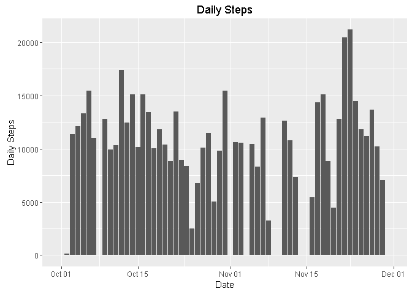
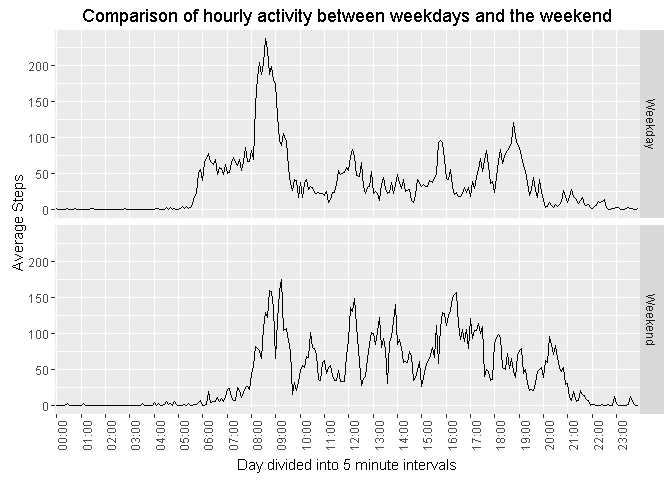

# Reproducible Research: Peer Assessment 1


## Introduction

It is now possible to collect a large amount of data about personal movement using activity monitoring devices such as a Fitbit, Nike Fuelband, or Jawbone Up. These type of devices are part of the “quantified self” movement – a group of enthusiasts who take measurements about themselves regularly to improve their health, to find patterns in their behavior, or because they are tech geeks. But these data remain under-utilized both because the raw data are hard to obtain and there is a lack of statistical methods and software for processing and interpreting the data.

This assignment makes use of data from a personal activity monitoring device. This device collects data at 5 minute intervals through out the day. The data consists of two months of data from an anonymous individual collected during the months of October and November, 2012 and include the number of steps taken in 5 minute intervals each day.

The questions that will be addressed in this paper are:

1. Histogram of the total number of steps taken each day
2. Mean and median number of steps taken each day
3. Time series plot of the average number of steps taken
4. The 5-minute interval that, on average, contains the maximum number of steps
5. Code to describe and show a strategy for imputing missing data
6. Histogram of the total number of steps taken each day after missing values are imputed
7. Panel plot comparing the average number of steps taken per 5-minute interval across weekdays and weekends

## Loading and preprocessing the data

The raw data is contained in a zip file which is unpacked and read into a variable called **steps**. The raw data is pre-processed to allow easy analysis and address questions about the data:

* the date column is converted into a date object.
* the interval column is converted from an integer to a string representing the start of the five minute interval.
* the day of week number is calculated for each date (1=Monday)
* a final column is added to indicate whether the date of the observation falls on a weekday or weekend.


```r
unzip("./activity.zip")
steps<-read.csv("./activity.csv", header = TRUE)
steps$date <- as.Date(steps$date)
# Pad out the interval integer to 4 digits and insert a : between HH and MM
steps$interval <- formatC(steps$interval, width=4, flag="0")
steps$interval <- gsub('([0-9]{2})([0-9]{2})', '\\1:\\2',steps$interval)
steps$dayofweek <- strftime(steps$date,'%u')
steps$daytype <- ifelse(steps$dayofweek %in% c("6", "7"), "Weekend", "Weekday")
kable(head(steps))
```


 steps  date         interval   dayofweek   daytype 
------  -----------  ---------  ----------  --------
    NA  2012-10-01   00:00      1           Weekday 
    NA  2012-10-01   00:05      1           Weekday 
    NA  2012-10-01   00:10      1           Weekday 
    NA  2012-10-01   00:15      1           Weekday 
    NA  2012-10-01   00:20      1           Weekday 
    NA  2012-10-01   00:25      1           Weekday 

The first few observations from the transformed dataset are shown in the table above.

## Number of Daily steps 

The **steps** dataframe is summarised by grouping the time periods for each day and summing the total number of steps.  At this stage, the data contains missing values which are ignored for now.  This will be addressed later in the paper.  

The resulting **daily_steps** variable can them be plotted as a histogram which gives a sense of how the daily total varies over the two months.

```r
daily_steps <- steps %>% group_by(date) %>%
                         summarise(daily_steps=sum(steps, na.rm=TRUE))
ggplot(daily_steps,aes(x=date,y=daily_steps))+
                   geom_bar(stat="identity") +
                   ylab("Daily Steps") + xlab("Date") +
                   ggtitle("Daily Steps")
```



It can be seen from the plot above that there are missing bars for certain days.  This will be dealt with later in the paper.

## What is mean total number of steps taken per day?

The **daily_steps** data frame can be used to calculate the mean number of steps per day as follows: 

```r
daily_mean_steps <- mean(daily_steps$daily_steps)
daily_median_steps <- median(daily_steps$daily_steps)
```

This gives a daily mean of 9354.2295082 steps taken.  The daily median is 10395.


## What is the average daily activity pattern?

Each day is divided into five minute intervals, starting at midnight.  We first find the mean of each five minute period across all the days in the study for which there are measurements (missing values will be ignored for now and we'll return to them later in the paper).

When graphing the average value in each of the 288 time slots (12 per hour * 24 hours), we will only create labels on the x axis for each hour to make it easier to read.


```r
daily_interval <- steps %>% group_by(interval) %>%
                         summarise(average_steps=mean(steps, na.rm=TRUE))

# keep labels only ending in 00, ie on the hour
hour_intervals <- ifelse(grepl('00$', daily_interval$interval), daily_interval$interval, FALSE)
ggplot(daily_interval,aes(x=interval,y=average_steps))+
                   geom_bar(stat="identity") +
                   ylab("Average Steps") + xlab("Day divided into 5 minute intervals") +
                   theme(axis.text.x = element_text(angle = 90, hjust = 1)) +
                   scale_x_discrete(breaks=hour_intervals) +
                   ggtitle("Average Daily Activity during each hour")
```


From the graph above, we can see that the average busiest period is between 8am and 9am, and a small calculation can be made to find the precise interval where the maximum occurs.  The daily intervals are ordered in reverse order, with the maximum number of steps at the top.  The first row of this ordering will therefore give the time interval where the maximum occurs.

```r
interval_max_steps <- daily_interval[order(daily_interval$average_steps, decreasing = T)[1],]
```

This calculation shows that 08:35 is the 5 minute time period with the most steps on average, which also tallies with a visual inspection of the graph.

## Imputing missing values

We know there are some missing values in the data, so we first need to get a feeling for where they occur.   The maximum number in any day is 288 (12 intervals per hour over 24 hours).  The following code counts how many non missing observations there are, and which days have less than 288.


```r
obs_per_day <-steps %>% group_by(date) %>% summarise(num_obs=sum(!is.na(steps)))
kable(subset(obs_per_day, num_obs<288))
```


date          num_obs
-----------  --------
2012-10-01          0
2012-10-08          0
2012-11-01          0
2012-11-04          0
2012-11-09          0
2012-11-10          0
2012-11-14          0
2012-11-30          0

We can see that all the missing observations occur on only 8 days, and furthermore, no observations at all were made on these days.

The strategy I have chosen for imputing missing values is to take the mean for each interval on the same day of week as the missing data.  That is, if one of the missing days is a Wednesday, then we will substitute the missing intervals with the mean of the equivalent intervals on all the other wednesdays that we do have observations for.


```r
wday_steps <- steps %>% group_by(dayofweek, interval)  %>%
                        summarise(steps=mean(steps, na.rm=TRUE))

merged_steps <- merge(steps, wday_steps, by=c("dayofweek", "interval")) %>%
                rename(obs_steps=steps.x, mean_steps=steps.y)
# choose the mean value if the observed value is missing
merged_steps$steps=ifelse(is.na(merged_steps$obs_steps), 
                          merged_steps$mean_steps, merged_steps$obs_steps)

imputed_daily_steps <- merged_steps %>% group_by(date) %>%
                         summarise(daily_steps=sum(steps, na.rm=TRUE))
ggplot(imputed_daily_steps,aes(x=date,y=daily_steps))+
                   geom_bar(stat="identity") +
                   ylab("Daily Steps") + xlab("Date") +
                   ggtitle("Daily steps with imputed missing values")
```


The plot now includes values for all days since the missing days now have values imputed from similar days.  The value on 15 November looks as if it is missing - it is present however, but very small, as can be seen from the following:


```r
subset(imputed_daily_steps, date=="2012-11-15")
```

```
## Source: local data frame [1 x 2]
## 
##         date daily_steps
##       (date)       (dbl)
## 1 2012-11-15          41
```


## Are there differences in activity patterns between weekdays and weekends?


```r
weekdayweekend_interval <- steps %>% group_by(daytype, interval) %>%
                         summarise(average_steps=mean(steps, na.rm=TRUE))
ggplot(weekdayweekend_interval,aes(x=interval,y=average_steps)) +
                   geom_bar(stat="identity") +
                   ylab("Average Steps") + xlab("Day divided into 5 minute intervals") +
                   theme(axis.text.x = element_text(angle = 90, hjust = 1)) +
                   scale_x_discrete(breaks=hour_intervals) +
                   facet_grid(. ~ daytype) +
                   ggtitle("Comparison of hourly activity between weekdays and the weekend")
```



